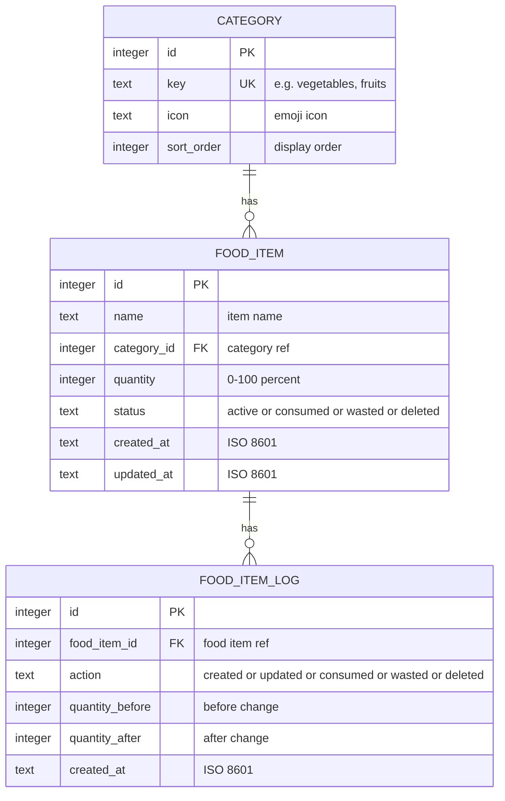
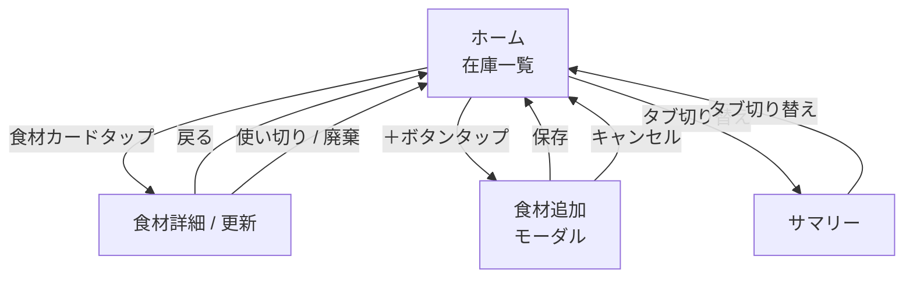

# Functional Design

## データモデル

### ER 図



### テーブル詳細

#### `category`

アプリ初回起動時にシードデータとして投入する。MVP ではユーザーによるカテゴリ追加は不可。

| key | icon | sort_order |
|-----|------|-----------|
| vegetables | 🥬 | 1 |
| fruits | 🍎 | 2 |
| meat | 🥩 | 3 |
| fish | 🐟 | 4 |
| dairy | 🥛 | 5 |
| seasoning | 🧂 | 6 |
| other | 📦 | 7 |

#### `food_item`

- `quantity`: 0〜100 の整数。スライダーの値をそのまま保存
- `status`:
  - `active`: 在庫あり（一覧に表示）
  - `consumed`: 使い切り済み（一覧から非表示）
  - `wasted`: 廃棄済み（一覧から非表示）
  - `deleted`: 削除済み（一覧から非表示、サマリー集計からも除外）

#### `food_item_log`

食材の状態変化を記録する履歴テーブル。サマリー画面での集計に使用。

- `action`: 実行された操作の種類
- `quantity_before` / `quantity_after`: 変更前後の残量を記録

## 画面設計

### 画面一覧

| 画面 | ルート | 対応機能 |
|------|--------|---------|
| ホーム（在庫一覧） | `/` (tabs: home) | F-1 |
| 食材追加 | `/add` (modal) | F-2 |
| 食材詳細 / 更新 | `/items/:id` | F-3 |
| サマリー | `/` (tabs: summary) | F-4 |

### 画面遷移図



### 画面詳細

#### ホーム（在庫一覧）

```
┌─────────────────────────────────┐
│  mottainai              [+]    │  ← ヘッダー + 追加ボタン
├─────────────────────────────────┤
│  [All] [🥬] [🍎] [🥩] ...     │  ← カテゴリフィルタ（横スクロール）
├─────────────────────────────────┤
│  ┌─────────────────────────┐   │
│  │ 🥬 にんじん             │   │
│  │ ████████░░░░░░░░  60%  │   │  ← 食材カード
│  └─────────────────────────┘   │
│  ┌─────────────────────────┐   │
│  │ 🥛 牛乳                │   │
│  │ ███░░░░░░░░░░░░░  20%  │   │
│  └─────────────────────────┘   │
│  ┌─────────────────────────┐   │
│  │ 🥩 鶏むね肉             │   │
│  │ ██████████████░░  85%  │   │
│  └─────────────────────────┘   │
│                                 │
├─────────────────────────────────┤
│  [🏠 Home]     [📊 Summary]   │  ← タブバー
└─────────────────────────────────┘
```

- カードタップ → 食材詳細画面へ遷移
- [+] ボタンタップ → 食材追加モーダルを表示
- カテゴリフィルタ: 「All」選択時は全件表示、カテゴリアイコンタップで絞り込み
- 空状態: 食材未登録時に「＋ボタンで食材を追加しましょう」メッセージ

#### 食材追加（モーダル）

```
┌─────────────────────────────────┐
│  Add Item            [Cancel]  │
├─────────────────────────────────┤
│                                 │
│  Name                          │
│  ┌─────────────────────────┐   │
│  │ (食材名を入力)          │   │
│  └─────────────────────────┘   │
│                                 │
│  Category                      │
│  ┌─────────────────────────┐   │
│  │ 🥬 Vegetables           ▼│  │  ← ピッカー
│  └─────────────────────────┘   │
│                                 │
│  ┌─────────────────────────┐   │
│  │        Save              │   │
│  └─────────────────────────┘   │
│                                 │
└─────────────────────────────────┘
```

- Name: 必須、1〜50文字
- Category: 必須、カテゴリ一覧から選択
- Save: バリデーション通過後に保存、quantity = 100 で登録
- Cancel: 入力内容を破棄してモーダルを閉じる

#### 食材詳細 / 更新

```
┌─────────────────────────────────┐
│  [←]  にんじん         [edit]  │
├─────────────────────────────────┤
│                                 │
│          🥬                     │
│       にんじん                   │
│      Vegetables                 │
│                                 │
│  ┌─────────────────────────┐   │
│  │                         │   │
│  │         60%             │   │
│  │  ○────────●─────────    │   │  ← スライダー
│  │                         │   │
│  └─────────────────────────┘   │
│                                 │
│  ┌───────────┐ ┌───────────┐   │
│  │  Used Up  │ │  Wasted   │   │  ← アクションボタン
│  │    ✅     │ │    🗑️     │   │
│  └───────────┘ └───────────┘   │
│                                 │
│  ┌─────────────────────────┐   │
│  │       Delete Item       │   │  ← 削除ボタン（末尾配置）
│  └─────────────────────────┘   │
│                                 │
└─────────────────────────────────┘
```

- スライダー: 0〜100 のステップ、ドラッグで残量変更、離した時点で保存
- Used Up: 確認ダイアログ → consumed 記録 → ポジティブフィードバック → 一覧に戻る
- Wasted: 確認ダイアログ → wasted 記録 → 一覧に戻る
- edit: 食材名・カテゴリの編集モードに切り替え
- Delete Item: 確認ダイアログ → deleted 記録 → 一覧に戻る
- ポジティブフィードバック: 使い切り時にトースト表示（例: "Nice! You used it all up! 🎉"）

#### サマリー

```
┌─────────────────────────────────┐
│  Summary                       │
├─────────────────────────────────┤
│                                 │
│  ┌─────────────────────────┐   │
│  │    Use-up Rate           │   │
│  │       75%               │   │  ← 円グラフ or 大きい数字
│  └─────────────────────────┘   │
│                                 │
│  ┌────────┐  ┌────────┐       │
│  │ Used Up│  │ Wasted │       │
│  │   12   │  │   4    │       │
│  └────────┘  └────────┘       │
│                                 │
│  ┌─────────────────────────┐   │
│  │  Current Items: 8       │   │
│  └─────────────────────────┘   │
│                                 │
├─────────────────────────────────┤
│  [🏠 Home]     [📊 Summary]   │
└─────────────────────────────────┘
```

- Use-up Rate: consumed / (consumed + wasted) × 100
- Used Up: consumed 件数の累計
- Wasted: wasted 件数の累計
- Current Items: status = active の件数
- データ 0 件時: 「まだデータがありません」メッセージ

## コンポーネント設計

### コンポーネントツリー

```
App
├── TabNavigator
│   ├── HomeScreen
│   │   ├── CategoryFilter
│   │   ├── FoodItemCard (list)
│   │   │   ├── CategoryIcon
│   │   │   └── QuantityBar
│   │   └── EmptyState
│   └── SummaryScreen
│       ├── UseUpRateCard
│       ├── StatsCard
│       └── EmptyState
├── ItemDetailScreen
│   ├── CategoryIcon
│   ├── QuantitySlider
│   ├── ActionButtons (Used Up / Wasted)
│   ├── DeleteButton
│   └── EditItemForm
└── AddItemModal
    ├── TextInput (name)
    ├── CategoryPicker
    └── SaveButton
```

### 共通コンポーネント

| コンポーネント | 用途 |
|--------------|------|
| `CategoryIcon` | カテゴリの絵文字アイコンを表示 |
| `QuantityBar` | 残量をプログレスバーで表示（色: 緑→黄→赤） |
| `EmptyState` | データ 0 件時のメッセージ表示 |
| `ConfirmDialog` | 使い切り/廃棄/削除の確認ダイアログ |
| `Toast` | ポジティブフィードバック等のトースト通知 |

### QuantityBar の色ルール

| 残量 | 色 |
|------|-----|
| 51〜100% | 緑 (#4CAF50) |
| 21〜50% | 黄 (#FFC107) |
| 0〜20% | 赤 (#F44336) |
